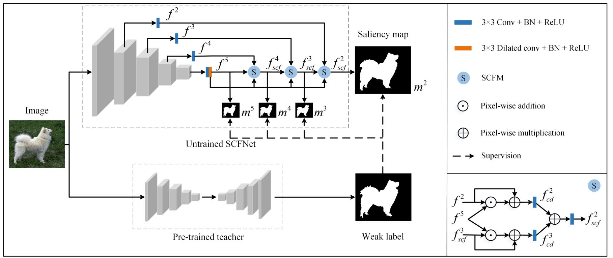

# KD-SCFNet



**KD-SCFNet: Towards More Accurate and Efficient Salient Object Detection via Knowledge Distillation**<br />
Jin Zhang, Qiuwei Liang, Yanjiao Shi<br />
European Conference on Computer Vision 2022 (ECCV2022)<br />

Code, models and dataset will be released around mid-July! Please stay tuned! :blush:

## Notification

The code is implemented by the PaddlePaddle, which is a DL framework written like the PyTorch, so there will be no difficulty in reading. **It is very welcome and pleasure if you can recurrent the results with your PyTorch code.** We will also try the PyTorch reimplement, and the PyTorch code will release later.

## Requirements

- python 3.7<br />
- paddlepaddle-gpu 2.2.0<br />
- opencv-python 4.1.1.26<br />
- One V100 32G GPU

## Datasets

### KD-SOD80K

In this paper, we choose 80K images from ImageNet, and name this dataset as KD-SOD80K.<br />
Dataset download links: [BaiDu](https://pan.baidu.com/s/16xQwUFdp8t3hk3Oa5ifMrg?pwd=sota), [Google](https://drive.google.com/drive/folders/1TSm6gFJuAp1jC1TPcE7WhFisSTFANfRi?usp=sharing)

### Public Datasets
There are five most popular general-purpose datasets DUTS, ECSSD, HKU-IS, DUT-OMRON, PASCAL-S that used in this paper. <br />
Dataset download links: [GitHub](https://github.com/jiwei0921/SOD-CNNs-based-code-summary-#2D%20RGB%20Saliency%20Detection). If necessary, please download these datasets and unzip them in the `data` folder.

## Results

### Fully Supervised
| Model  | Params | FLOPs | DUTS-TE | ECSSD | HKU-IS | DUT-O | PASCAL-S| Saliency Map | Pretrained Weight | 
|:---:|:---:|:---:| :---:| :---:| :---:| :---:| :---:| :---:| :---:|
| FS-SCFNet | 0.8M | 0.25G | 0.041 |  0.039 |  0.031 |  0.059 |  0.068 | [BaiDu](https://pan.baidu.com/s/16xQwUFdp8t3hk3Oa5ifMrg?pwd=sota), [Google](https://drive.google.com/file/d/1hmIFlfKGwIHWYMRz9qGfVGzu4ZVbURXk/view?usp=sharing) | [BaiDu](https://pan.baidu.com/s/16xQwUFdp8t3hk3Oa5ifMrg?pwd=sota), [Google](https://drive.google.com/file/d/16Sd3jk44kDDhpkbO6fkZ4JrGDGT8rTcA/view?usp=sharing)|
| SCFNet$_{R50}$ | 26.15M | 13.15G | 0.031 |  0.031 |  0.026 |  0.047 |  0.060 | [BaiDu](https://pan.baidu.com/s/16xQwUFdp8t3hk3Oa5ifMrg?pwd=sota), [Google](https://drive.google.com/file/d/1Neks1YNJNVLhpGD5BJWAzelxlibwD1nU/view?usp=sharing) | [BaiDu](https://pan.baidu.com/s/16xQwUFdp8t3hk3Oa5ifMrg?pwd=sota), [Google](https://drive.google.com/file/d/1LeSxaZ8jLin5UOKm2TBQckv0IhPFDI54/view?usp=sharing)|
| SCFNet$_{STB}$ | 88.16M | 46.74G | 0.026 |  0.023 |  0.021 |  0.045 |  0.051 | [BaiDu](https://pan.baidu.com/s/16xQwUFdp8t3hk3Oa5ifMrg?pwd=sota), [Google](https://drive.google.com/file/d/1DI4yjPJsxYytNnrPbxwd3ziKDx3LYN7E/view?usp=sharing) | [BaiDu](https://pan.baidu.com/s/16xQwUFdp8t3hk3Oa5ifMrg?pwd=sota), [Google](https://drive.google.com/file/d/1d-jhK5WBLes-ME-cNIIXh5pMZHnXGPi4/view?usp=sharing)|

###  Knowledge Distillation Based
| Model | Teacher | Params | FLOPs | DUTS-TE | ECSSD | HKU-IS | DUT-O | PASCAL-S| Saliency Map | Pretrained Weight | 
|:---:|:---:|:---:|:---:| :---:| :---:| :---:| :---:| :---:|:---:| :---:|
| KD-SCFNet | SCFNet$_{R50}$ | 0.8M | 0.25G | 0.035 |  0.035 |  0.029 |  0.052 |  0.061 |[BaiDu](https://pan.baidu.com/s/16xQwUFdp8t3hk3Oa5ifMrg?pwd=sota), [Google](https://drive.google.com/file/d/1bnYjTTFJBBiGp-KPVRUbBDlDXkzITkyk/view?usp=sharing) | [BaiDu](https://pan.baidu.com/s/16xQwUFdp8t3hk3Oa5ifMrg?pwd=sota), [Google](https://drive.google.com/file/d/1pzR914hF078dJ762DLFoVOk72AREtjVn/view?usp=sharing)|
| KD-SCFNet | SCFNet$_{STB}$ | 0.8M | 0.30G | 0.035 |  0.030 |  0.026 |  0.054 |  0.056 |[BaiDu](https://pan.baidu.com/s/16xQwUFdp8t3hk3Oa5ifMrg?pwd=sota), [Google](https://drive.google.com/file/d/1dc76-jVW1tabeMhehj2WC39iolUKXFVI/view?usp=sharing) | [BaiDu](https://pan.baidu.com/s/16xQwUFdp8t3hk3Oa5ifMrg?pwd=sota), [Google](https://drive.google.com/file/d/1WX8iFMkuE8RxFtOwJT_bPlyyBu84n0Eq/view?usp=sharing)|

The performance of the proposed model under mean absolute error (MAE).
## Train

Make sure you have downloaded and unzipped the dataset to the `data` directory, and that the GPU version of PaddlePaddle is installed.

Anyway, the whole directory should looks like:

```
  ../
     ├── SCFNet
     ├── ...
     │ 
     └── data
           
           ├── DUTS-TR
           ├── ECSSD
           ├── KD-SOD80K
           ├── PASCAL-S
           ├── HKU-IS
           ├── DUTS-TE
           └── DUT-OMRON
                   ├── image
                   ├── mask
                   └── test.txt
  ```

### SCFNet$_{R50}$

You need to change the parameter 'model_type' to 'R50' in line 20 in `train_FS.py`, then use the following command to train the SCFNet$_{R50}$.

`python SCFNet/train_FS.py`

the trained weight can be seen at `./weight`

### FS-SCFNet

You can use the following command to train the FS-SCFNet.

`python SCFNet/train_FS.py`

### KD-SCFNet

You can use the following command to train the KD-SCFNet.

Download the teacher model's pretrained weight or used the trained one by you
then adjust the teacher model in line 160-163 in `train_KD.py`.

`python SCFNet/train_KD.py`

## Test

You can run the function `mutil_test_score(param1, param2)` in `test.py` to caculate the metrics. param1 is the parent directory of the predicted saliency maps for the 5 datasets. param2 is the address where the metrics results are saved. We use the code provided by this [repo.](https://github.com/Mehrdad-Noori/Saliency-Evaluation-Toolbox) to calculate the metrics.

The function `save_results` is used to generate saliency maps based on the model and weights.

The function `mutil_test_score` is used to calculate the metrics based on the saliency map predicted by the model and GTs 

- If you need to generate saliency maps based on the weight, change the path in lines 133-134 in `test.py`, else comment out the line 135.
- Run `python test.py`

## Performance


Comparison of the proposed model with existing SOTA models

## Citation

## FAQ

Q1: Why use the PaddlePaddle framework？

A1: [AI Studio](https://aistudio.baidu.com/aistudio/index) provides rich computing resources, and PaddlePaddle is similar to PyTorch's API, making it easy to use.

Q2: Why can't I reimplement to the accuracy reported in paper?

A2: Since there is no fixed random seed, unfortunately the same results cannot be reproduced, but the results generated by the code will be roughly the same as in the paper.

··· More questions are welcome

