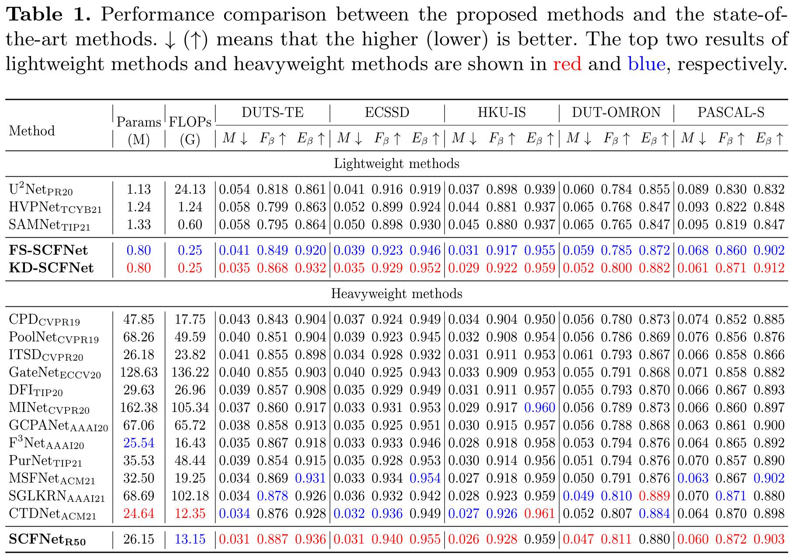

# KD-SCFNet

**KD-SCFNet: Towards More Accurate and Efficient Salient Object Detection via Knowledge Distillation** 
Jin Zhang, Qiuwei Liang, Yanjiao Shi 
European Conference on Computer Vision 2022 (ECCV2022) 

Code, models and dataset will be released around mid-July! Please stay tuned! :blush:
